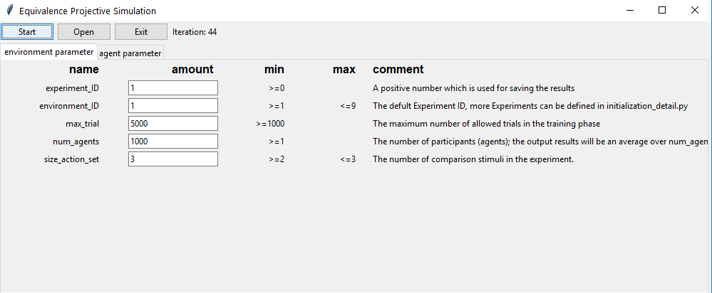
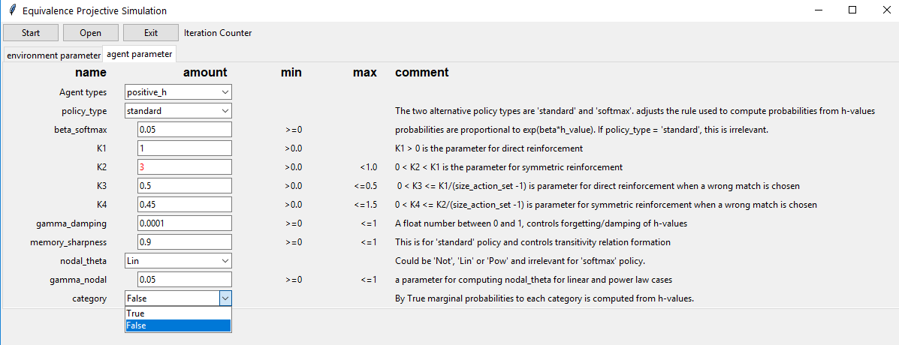
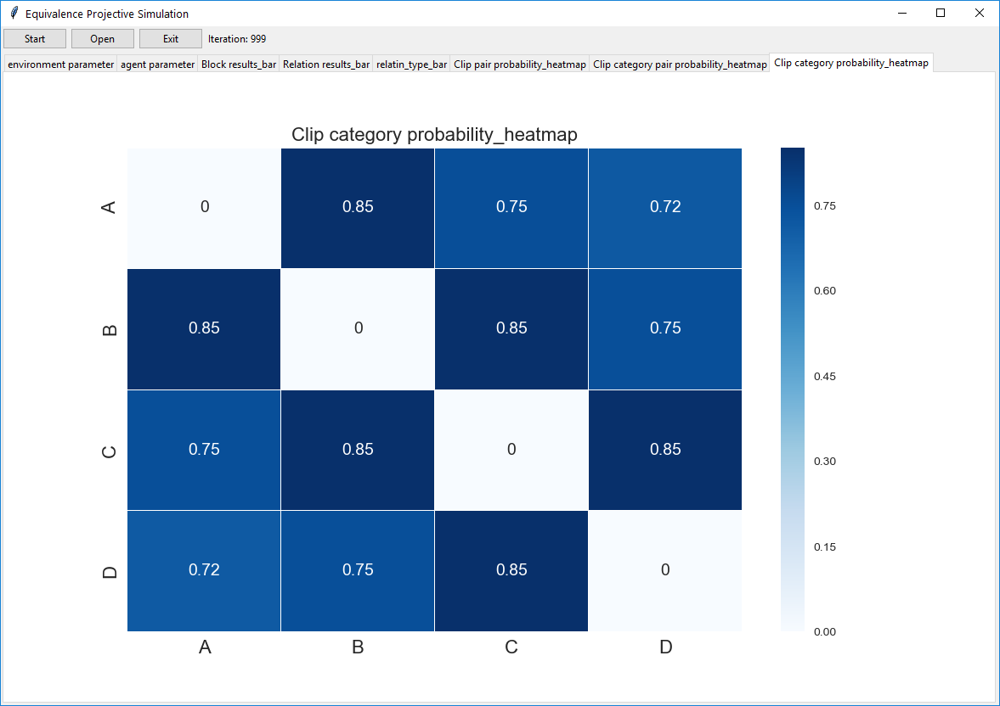
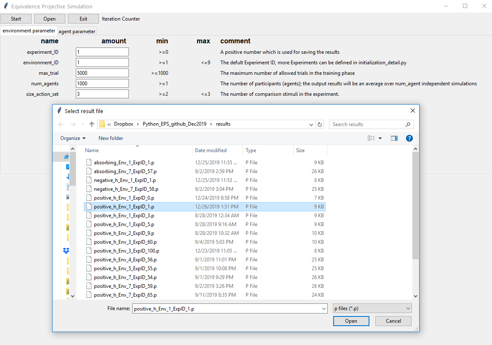

# Equivalence Projective Simulation (EPS)
This code simulates the "equivalence projective simulation" model that introduced in the paper entitled:

**"Equivalence Projective Simulation as a Framework for Modeling Formation of Stimulus Equivalence Classes"**, Neural Computation, MIT press,

EPS computationally models formation of equivalence classes in Behavior Analysis. Briefly, in an arbitrary MTS experiment, first
some arbitrary relations say A1-B1, A2-B2, B1-C1, B2-C2, are trained through a matching-to-sample procedure. Then, after agent masters these relations, i.e. answering correctly to say 90% of the trials in a block of certain size of trials, the agent will be tested for **derived** relations, say A1-C1, C2-A2. 

## Prerequisites

This code has been tested with Python 3.6.5 (Anaconda)

The Interface has been tested on Windows 10

Initial values must be assign based on the guideline, otherwise the program might crash for not valid initial values

## Getting Started

There are two options to initialize the parameters and run the code: 
- If you run the "main_gui.py", you can initialize values through an interface (only Windows OS) 
- If you run the "main.py", you can change the initial values in initialization.py 

Through Initialization_detail.py you can add new environments settings (the detail is explained bellow). Through interface window just pre-defined experiments can be chosen. 

## Without interface:

- In the **main.py** you can only choose the agent_ID:
```python
0: 'positive_h', 
1: 'negative_h',
2: 'viterbi',
3: 'absorbing'
```
where
- **positive_h**: h-values must be positive. New connections are computed based on max-product using Dijekstra algorithm.
- **negative_h**: h-values are negative. K3, and K4 are not used in training (no indirect reinforcement) and just 'softmax' policy is applicable. The computation of probabilities is similar to the positive-h.
- **viterbi**: Find the max-product value through a trellis diagram and Viterbi algorithm. First the order of categories that the path with highest probability is passes is find, then extra edges will be removed and probabilities will be computed. So probabilities out of h-values computed in a different way.
- **absorbing**: The case that derived relations are computed based on a random walk, when action_set forms the absorbing states.

- To see the results for a previous simulation, change file_name= None to a file name in the results folder, say
```python 
filename= 'results/viterbi_Env_1_ExpID_1.p'
```
- Other parameters of environment and agent, can be changed in **initialization.py**:

### For environment

"environment_parameter" can be updated:
 ```python 
 environment_parameter = {"experiment_ID": [0],
        "environment_ID": [1],
        "max_trial": [10000],
        "num_agents": [1000],
        "size_action_set": [2]}
```
where: 
**experiment_ID**: \
A positive number which is used for saving the results in the results folder. The file name would be: 
'agent_type_Env_environment_ID_ExpID_experiment_ID'
    
**environment_ID**: \
Is the key number to the default ID numbers (1-9), that adresses the details of a protocol. New environment settings under new Environment_IDs can be added in **initialization_detail.py** (see bellow)

**max_trial**: \
The maximum number of allowed trials in the training phase. If the learning is so slow due to the parameters, the training might not be finished

**num_agents**: \
The number of participants (agents); The program will be repeated for num_agents times and the final result would be the average

**size_action_set**: \
The number of comparison stimuli in the experiment. This must be at least 2 and at most equals the "num_classes"

### For agent
Depending on the chosen "agent_ID", **agent_parameter** with the appropriate key must be changed. For instance if agent_ID = 0, 'positive_h' parameters must be changed:
```python
     'positive_h':
     {
     "policy_type": ['standard'],
     "beta_softmax": [0.02],
     "K1": [1],
     "K2": [0.9],
     "K3": [0.5],
     "K4": [0.45],
     "gamma_damping": [0.01],
     "memory_sharpness": [0.5],
     "nodal_theta": ['Lin'],
     "gamma_nodal": [0.8],
     "category": ["False"]
     },
```
where:\
**policy_type**: 
Could be ['standard', 'softmax']. The difference is on computation of probabilities from h-values. In 'standard' type, h-values must be positive.

**beta_softmax**: 
Applicable for 'softmax' type. float >=0, probabilities are proportional to exp(beta_softmax*h_value). Its higher value, increases the chance of an edge with the largest h-value to be chosen.
- Save the changes and run main.py

**K1**: Is a positive value for updating the h-values and the default value is one based on original PS. In the model K1 could be any positive value

**K2**: A positive number which represents the symmetry relation in the model and upper bounded by K1 

**K3**: A positive number, upper bounded by where K1/(size_action_set - 1). K3 is used in the negative reward case in order to reinforce other options compare to the wrong choice agent have done. This parameter helps to keep the h-values positive. If the agent_type ='negative_h', K3 and K4 are irrelevant since the h-values can be negative. 

**K4**: Similar to K2 for symmetric relations, in the negative reward situation.

**gamma_damping**: A float number between 0 and 1 which controls forgetting/damping of h-values. The closer to zero, the less forgetting and the closer to one, the less learning/memory.

**memory_sharpness**: A value between 0 and one, controls the formation of transitive relations. The better transitive formation in memory, the higher value of mempry_sharpness. Applicable for 'standard' type and the default value is 1. memory_sharpness = 1 means memory is used completely and  memory_sharpness = 0 means actions will be random for the derived cases.


    
**nodal_theta**: 
Could be ['Not', 'Lin', 'Pow'] and applicable for 'standard' type. nodal_theta and gamma_nodal are related to nodal effect and provide options for computing probabilities in derived relations. 

**gamma_nodal**: \
float >= 0 where gamma_nodal = 0 means no nodal effect. If, nodal_theta = 'Lin', for gamma_nodal >= mempry_sharpness/D_nodal, the choices would be random. Closer value to zero, less nodal effect. Applicable for 'standard' type. 

**category**: \
Could be ['True', 'False']. If category = True, The transition probabilities are computed as marginal probabilities for each category. For instance, if A-B and A-C are trained, then the sum of output probabilities from A would be 2 in the case of category = True, and one otherwise. The default value is category = False.

### Adding new Environment Settings:
Through **initialization_detail.py** new experiments can be added by defining new environment_IDs to the default 1-9: 
```python
environment_parameters_detail = {
    1: { 
        "num_classes":3,
        "training_order": 
        ...
        "mastery_training":  0.9 },
    2: {...
    ...
    10: {
```

**num_classes**: Is the number of classes in the experiment and must be compatible with training_order. Note that 
**size_action_set** initializes at initialization.py upper bounded by "num_classes".

**training_order**: \
The structure of training and blocks in dict() format. There are two ways to initialize it though:

1. let
```python
num_classes=4,
training_order={ \
                1: [('A', 'B', 30)], \
                2: [('B', 'C', 30)], \
                3: [('D', 'C', 30)] \
                }
``` 
and in initialization.py, we set 
```python
"size_action_set": [3]
```
The key values 1, 2, 3 shows the order of training. As an example, the first block contains 30 trials of relations with A1, A2, A3, or A4 as the sample stimuli and three comparison stimuli from B1, B2, B3, and B4. Note that the correct choice must be among the comparison stimuli, say for A2, (B1, B3, B4) is not a valid action set/comparison stimuli. Moreover, that number of trials at each block must be a multiple of num_classes. Since, the model produce the same number of trial for each particular pair. 
 
2. let num_classes=2, and size_action_set=2, and
```python
     training_order={ \
                     1:[('A1', 'B1', 10)],\
                     2:[('A2', 'B2', 10)],\
                     3:[('A1', 'B1', 5),('A2', 'B2', 5)],\
                     4:[('A1', 'C1', 10)],\
                     5:[('A2', 'C2', 10)],\
                     6:[('A1', 'C1', 5),('A2', 'C2', 5)],\
                     7:[('A1', 'B1', 2),('A2', 'B2', 2),('A1', 'C1', 2),('A2', 'C2', 2)]\
                    }
 ```                   
In this case, the desired relation to be trained in each block and the number of its repetition is determined. The num_classes must be compatible with the provided relations. The above training_order means after mastery of relation A1-B1 in blocks of 10 trials, A2-B2 will be trained, then a block of mixed A1-B1 and A2-B2. Next, A1-C1, then A2-C2 and then a mixed block of A1-C1, A2-C2. Finally, all the trained relations construct a block and by passing the mastery criterion, the training phase will be finished.   

**testing_order**: \
The structure of testing blocks and the order is provided here. It must be similar to the First format of training test, say: 

```python
    testing_order={\
                    1:[('A', 'B', 9),('B', 'C', 9),('D' ,'C', 9)],\
                    2:[('B', 'A', 9),('C', 'B', 9),('C', 'D', 9)],\
                    3:[('A', 'C', 9)],\
                    4:[('C', 'A', 9),('B', 'D', 9), ('D', 'B', 9),('A', 'D', 9),('D', 'A', 9)]\
                   }
```            
In order to reporting the results, two other dict() needs to be set in accordance with the training_order:
- **test_block_ID**: \
For naming the blocks in result representation. One sample could be:
```python
{1:'Baseline', 2:'Symmetry', 3:'Transivity', 4:'Equivalence'}
```
- **plot_blocks**: \
That is an option for desired combination of relations, say:
```python        
   plot_blocks= {\
                'Direct':['AB', 'BC', 'DC'],\
                'Derived':['BA', 'CB', 'CD', 'AC', 'CA', 'BD', 'DB', 'AD', 'DA']\
                 }
  ```            
where 'AB' means all possible relations between the two categories say A1-B1, A2-B2, A3-B3, etc. One must set it as empty dict() to remove this extra plot. 
```python        
        "plot_blocks_ID": {'relatin_type':['Direct','Derived']}
```
**mastery_training**: \
A value between 0 and one that shows the mastery criterion. 0.9 means 90% correct choices in a block.  


## Using interface:

- Run main_gui.py and determine the environment parameters in the first tab:



- Determine the agent parameters in the second tab:



- If the values are not between the range specified in min and max column, the color turns into red and the start button does not function. Please read the comments and choose appropriate values. Then through
**Start** button, run the program, a counter shows the iteration number and after reaching the specified **num_agent**,
the results will be shown in new tabs:



- Results for a previous stored simulation can be seen using **open** button:



## Process summary

 By initialization and running either main.py or main_gui.py:

- An agent, an environment, an interaction, and possibly an interface object will be initializes

- The results to be plotted will be saved in a pickle file in the "results" folder.

- The figures will be shown in new Tabs of interface or new windows.

- Results of a previously simulated data can be accessed by its ID.  

- Percept (sample stimulus) and action_set (comparison stimuli) belong to two different categories. 
 
- When blocks are constructed by environment, the order of comparison stimuli and the order of trials in the block are random.


## License

MIT license (MIT-LICENSE or http://opensource.org/licenses/MIT)


